# Design Document: Enterprise Accounting Platform

## Overview

This document describes the technical design for an enterprise-grade accounting platform targeting small-to-medium businesses. The system implements double-entry bookkeeping principles with a modern Angular 18+ frontend and Spring Boot 3.2+ backend architecture, following fintech industry standards and security best practices.

The application provides:
- Secure JWT-based authentication with RS256 signing and MFA support
- Role-based access control with fine-grained permissions
- Chart of accounts management with hierarchical support
- Journal entry recording with approval workflow and automatic balance validation
- Contact management (customers and vendors)
- Invoice and expense tracking with recurring transaction support
- Bank account management and reconciliation
- Financial report generation (Balance Sheet, Income Statement, Trial Balance, General Ledger, Cash Flow, Aging Reports)
- Dashboard with KPIs and analytics
- Comprehensive audit logging

## Architecture

### High-Level Architecture


### Request Flow


## Components and Interfaces

### Backend Components

#### Security Module

```java
// JWT Authentication Filter
public class JwtAuthenticationFilter extends OncePerRequestFilter {
    String extractToken(HttpServletRequest request);
    boolean validateToken(String token);
    Authentication getAuthentication(String token);
}

// JWT Token Provider with RS256
public interface JwtTokenProvider {
    String generateAccessToken(UserDetails userDetails);
    String generateRefreshToken(UserDetails userDetails);
    String getUsernameFromToken(String token);
    boolean validateToken(String token);
    Date getExpirationFromToken(String token);
    void revokeRefreshToken(String token);
}

// MFA Service
public interface MfaService {
    MfaSetupResponse setupMfa(Long userId);
    boolean verifyTotp(Long userId, String totpCode);
    void enableMfa(Long userId);
    void disableMfa(Long userId);
}

// User Details Service
public interface CustomUserDetailsService extends UserDetailsService {
    UserDetails loadUserByUsername(String email);
    void incrementFailedAttempts(String email);
    void resetFailedAttempts(String email);
    void lockAccount(String email, Duration duration);
}

// Rate Limiting Service
public interface RateLimitService {
    boolean isAllowed(String key, int maxRequests, Duration window);
    void recordRequest(String key);
}
```


#### Controller Layer

```java
// Authentication Controller
@RestController
@RequestMapping("/api/v1/auth")
public interface AuthController {
    @PostMapping("/register")
    ResponseEntity<UserDto> register(@Valid @RequestBody RegisterRequest request);

    @PostMapping("/login")
    ResponseEntity<AuthResponse> login(@Valid @RequestBody LoginRequest request);

    @PostMapping("/refresh")
    ResponseEntity<AuthResponse> refreshToken(@RequestBody RefreshTokenRequest request);

    @PostMapping("/logout")
    ResponseEntity<Void> logout(@RequestBody LogoutRequest request);

    @PostMapping("/mfa/setup")
    ResponseEntity<MfaSetupResponse> setupMfa();

    @PostMapping("/mfa/verify")
    ResponseEntity<AuthResponse> verifyMfa(@RequestBody MfaVerifyRequest request);

    @PostMapping("/password/forgot")
    ResponseEntity<Void> requestPasswordReset(@RequestBody PasswordResetRequest request);

    @PostMapping("/password/reset")
    ResponseEntity<Void> confirmPasswordReset(@Valid @RequestBody PasswordResetConfirm request);
}

// Account Controller
@RestController
@RequestMapping("/api/v1/accounts")
public interface AccountController {
    @GetMapping
    ResponseEntity<List<AccountDto>> getAllAccounts();

    @GetMapping("/{id}")
    ResponseEntity<AccountDto> getAccount(@PathVariable UUID id);

    @PostMapping
    ResponseEntity<AccountDto> createAccount(@Valid @RequestBody CreateAccountRequest request);

    @PutMapping("/{id}")
    ResponseEntity<AccountDto> updateAccount(@PathVariable UUID id, @Valid @RequestBody UpdateAccountRequest request);

    @DeleteMapping("/{id}")
    ResponseEntity<Void> deleteAccount(@PathVariable UUID id);

    @GetMapping("/tree")
    ResponseEntity<List<AccountHierarchyDto>> getAccountHierarchy();

    @GetMapping("/{id}/transactions")
    ResponseEntity<Page<JournalEntryLineDto>> getAccountTransactions(
        @PathVariable UUID id,
        @RequestParam(required = false) LocalDate startDate,
        @RequestParam(required = false) LocalDate endDate,
        Pageable pageable);

    @PostMapping("/import")
    ResponseEntity<ImportResultDto> importAccounts(@RequestParam MultipartFile file);

    @GetMapping("/export")
    ResponseEntity<Resource> exportAccounts(@RequestParam(defaultValue = "csv") String format);
}

// Journal Entry Controller
@RestController
@RequestMapping("/api/v1/journal-entries")
public interface JournalEntryController {
    @GetMapping
    ResponseEntity<Page<JournalEntryDto>> getJournalEntries(
        @RequestParam(required = false) LocalDate startDate,
        @RequestParam(required = false) LocalDate endDate,
        @RequestParam(required = false) UUID accountId,
        @RequestParam(required = false) JournalEntryStatus status,
        Pageable pageable);

    @GetMapping("/{id}")
    ResponseEntity<JournalEntryDto> getJournalEntry(@PathVariable UUID id);

    @PostMapping
    ResponseEntity<JournalEntryDto> createJournalEntry(@Valid @RequestBody CreateJournalEntryRequest request);

    @PutMapping("/{id}")
    ResponseEntity<JournalEntryDto> updateJournalEntry(@PathVariable UUID id, @Valid @RequestBody UpdateJournalEntryRequest request);

    @DeleteMapping("/{id}")
    ResponseEntity<Void> deleteJournalEntry(@PathVariable UUID id);

    @PostMapping("/{id}/submit")
    ResponseEntity<JournalEntryDto> submitForApproval(@PathVariable UUID id);

    @PostMapping("/{id}/approve")
    ResponseEntity<JournalEntryDto> approveJournalEntry(@PathVariable UUID id);

    @PostMapping("/{id}/post")
    ResponseEntity<JournalEntryDto> postJournalEntry(@PathVariable UUID id);

    @PostMapping("/{id}/void")
    ResponseEntity<JournalEntryDto> voidJournalEntry(@PathVariable UUID id);

    @PostMapping("/{id}/reverse")
    ResponseEntity<JournalEntryDto> reverseJournalEntry(@PathVariable UUID id);

    @GetMapping("/{id}/audit-trail")
    ResponseEntity<List<AuditLogDto>> getAuditTrail(@PathVariable UUID id);

    @PostMapping("/{id}/attachments")
    ResponseEntity<AttachmentDto> uploadAttachment(@PathVariable UUID id, @RequestParam MultipartFile file);

    @GetMapping("/{id}/attachments/{attachmentId}")
    ResponseEntity<Resource> downloadAttachment(@PathVariable UUID id, @PathVariable UUID attachmentId);
}
```


```java
// Contact Controller
@RestController
@RequestMapping("/api/v1/contacts")
public interface ContactController {
    @GetMapping
    ResponseEntity<Page<ContactDto>> getContacts(
        @RequestParam(required = false) ContactType type,
        Pageable pageable);

    @GetMapping("/{id}")
    ResponseEntity<ContactDto> getContact(@PathVariable UUID id);

    @PostMapping
    ResponseEntity<ContactDto> createContact(@Valid @RequestBody CreateContactRequest request);

    @PutMapping("/{id}")
    ResponseEntity<ContactDto> updateContact(@PathVariable UUID id, @Valid @RequestBody UpdateContactRequest request);

    @DeleteMapping("/{id}")
    ResponseEntity<Void> deleteContact(@PathVariable UUID id);

    @GetMapping("/{id}/transactions")
    ResponseEntity<Page<TransactionSummaryDto>> getContactTransactions(@PathVariable UUID id, Pageable pageable);

    @GetMapping("/{id}/statement")
    ResponseEntity<ContactStatementDto> getContactStatement(
        @PathVariable UUID id,
        @RequestParam LocalDate startDate,
        @RequestParam LocalDate endDate);
}

// Invoice Controller
@RestController
@RequestMapping("/api/v1/invoices")
public interface InvoiceController {
    @GetMapping
    ResponseEntity<Page<InvoiceDto>> getInvoices(
        @RequestParam(required = false) InvoiceStatus status,
        @RequestParam(required = false) InvoiceType type,
        Pageable pageable);

    @GetMapping("/{id}")
    ResponseEntity<InvoiceDto> getInvoice(@PathVariable UUID id);

    @PostMapping
    ResponseEntity<InvoiceDto> createInvoice(@Valid @RequestBody CreateInvoiceRequest request);

    @PutMapping("/{id}")
    ResponseEntity<InvoiceDto> updateInvoice(@PathVariable UUID id, @Valid @RequestBody UpdateInvoiceRequest request);

    @DeleteMapping("/{id}")
    ResponseEntity<Void> deleteInvoice(@PathVariable UUID id);

    @PostMapping("/{id}/send")
    ResponseEntity<InvoiceDto> sendInvoice(@PathVariable UUID id);

    @PostMapping("/{id}/record-payment")
    ResponseEntity<InvoiceDto> recordPayment(@PathVariable UUID id, @RequestBody RecordPaymentRequest request);

    @PostMapping("/{id}/void")
    ResponseEntity<InvoiceDto> voidInvoice(@PathVariable UUID id);

    @PostMapping("/{id}/write-off")
    ResponseEntity<InvoiceDto> writeOffInvoice(@PathVariable UUID id);

    @PostMapping("/{id}/duplicate")
    ResponseEntity<InvoiceDto> duplicateInvoice(@PathVariable UUID id);

    @GetMapping("/{id}/pdf")
    ResponseEntity<Resource> exportPdf(@PathVariable UUID id);

    @GetMapping("/aging-report")
    ResponseEntity<AgingReportDto> getAgingReport(@RequestParam(defaultValue = "RECEIVABLE") AgingType type);
}

// Expense Controller
@RestController
@RequestMapping("/api/v1/expenses")
public interface ExpenseController {
    @GetMapping
    ResponseEntity<Page<ExpenseDto>> getExpenses(Pageable pageable);

    @PostMapping
    ResponseEntity<ExpenseDto> createExpense(@Valid @RequestBody CreateExpenseRequest request);

    @PutMapping("/{id}")
    ResponseEntity<ExpenseDto> updateExpense(@PathVariable UUID id, @Valid @RequestBody UpdateExpenseRequest request);

    @DeleteMapping("/{id}")
    ResponseEntity<Void> deleteExpense(@PathVariable UUID id);
}

// Bank Account Controller
@RestController
@RequestMapping("/api/v1/bank-accounts")
public interface BankAccountController {
    @GetMapping
    ResponseEntity<List<BankAccountDto>> getAllBankAccounts();

    @GetMapping("/{id}")
    ResponseEntity<BankAccountDto> getBankAccount(@PathVariable UUID id);

    @PostMapping
    ResponseEntity<BankAccountDto> createBankAccount(@Valid @RequestBody CreateBankAccountRequest request);

    @PutMapping("/{id}")
    ResponseEntity<BankAccountDto> updateBankAccount(@PathVariable UUID id, @Valid @RequestBody UpdateBankAccountRequest request);

    @DeleteMapping("/{id}")
    ResponseEntity<Void> deleteBankAccount(@PathVariable UUID id);

    @GetMapping("/{id}/transactions")
    ResponseEntity<Page<BankTransactionDto>> getBankTransactions(@PathVariable UUID id, Pageable pageable);

    @PostMapping("/{id}/transactions/import")
    ResponseEntity<ImportResultDto> importBankTransactions(@PathVariable UUID id, @RequestParam MultipartFile file);

    @PostMapping("/{id}/reconcile")
    ResponseEntity<ReconciliationResultDto> completeReconciliation(@PathVariable UUID id, @RequestBody CompleteReconciliationRequest request);

    @GetMapping("/{id}/reconciliation-history")
    ResponseEntity<List<ReconciliationHistoryDto>> getReconciliationHistory(@PathVariable UUID id);
}

// Bank Transaction Controller
@RestController
@RequestMapping("/api/v1/bank-transactions")
public interface BankTransactionController {
    @PostMapping("/{id}/match")
    ResponseEntity<BankTransactionDto> matchTransaction(@PathVariable UUID id, @RequestBody MatchTransactionRequest request);

    @PostMapping("/{id}/create-entry")
    ResponseEntity<JournalEntryDto> createJournalEntry(@PathVariable UUID id, @RequestBody CreateEntryFromBankRequest request);

    @PostMapping("/{id}/exclude")
    ResponseEntity<BankTransactionDto> excludeTransaction(@PathVariable UUID id);
}

// Recurring Template Controller
@RestController
@RequestMapping("/api/v1/recurring-templates")
public interface RecurringTemplateController {
    @GetMapping
    ResponseEntity<List<RecurringTemplateDto>> getAllTemplates();

    @PostMapping
    ResponseEntity<RecurringTemplateDto> createTemplate(@Valid @RequestBody CreateRecurringTemplateRequest request);

    @PutMapping("/{id}")
    ResponseEntity<RecurringTemplateDto> updateTemplate(@PathVariable UUID id, @Valid @RequestBody UpdateRecurringTemplateRequest request);

    @DeleteMapping("/{id}")
    ResponseEntity<Void> deleteTemplate(@PathVariable UUID id);
}

// Report Controller
@RestController
@RequestMapping("/api/v1/reports")
public interface ReportController {
    @GetMapping("/balance-sheet")
    ResponseEntity<BalanceSheetDto> getBalanceSheet(@RequestParam LocalDate asOfDate);

    @GetMapping("/income-statement")
    ResponseEntity<IncomeStatementDto> getIncomeStatement(
        @RequestParam LocalDate startDate,
        @RequestParam LocalDate endDate);

    @GetMapping("/trial-balance")
    ResponseEntity<TrialBalanceDto> getTrialBalance(@RequestParam LocalDate asOfDate);

    @GetMapping("/general-ledger")
    ResponseEntity<GeneralLedgerDto> getGeneralLedger(
        @RequestParam UUID accountId,
        @RequestParam LocalDate startDate,
        @RequestParam LocalDate endDate);

    @GetMapping("/cash-flow-statement")
    ResponseEntity<CashFlowStatementDto> getCashFlowStatement(
        @RequestParam LocalDate startDate,
        @RequestParam LocalDate endDate);

    @GetMapping("/accounts-receivable-aging")
    ResponseEntity<AgingReportDto> getAccountsReceivableAging();

    @GetMapping("/accounts-payable-aging")
    ResponseEntity<AgingReportDto> getAccountsPayableAging();

    @GetMapping("/{reportType}/pdf")
    ResponseEntity<Resource> exportReportPdf(
        @PathVariable String reportType,
        @RequestParam Map<String, String> params);

    @GetMapping("/{reportType}/excel")
    ResponseEntity<Resource> exportReportExcel(
        @PathVariable String reportType,
        @RequestParam Map<String, String> params);

    @GetMapping("/{reportType}/csv")
    ResponseEntity<Resource> exportReportCsv(
        @PathVariable String reportType,
        @RequestParam Map<String, String> params);
}

// Dashboard Controller
@RestController
@RequestMapping("/api/v1/dashboard")
public interface DashboardController {
    @GetMapping("/summary")
    ResponseEntity<DashboardSummaryDto> getSummary();

    @GetMapping("/cash-flow-forecast")
    ResponseEntity<CashFlowForecastDto> getCashFlowForecast();

    @GetMapping("/revenue-trends")
    ResponseEntity<RevenueTrendsDto> getRevenueTrends(@RequestParam(defaultValue = "12") int months);

    @GetMapping("/expense-breakdown")
    ResponseEntity<ExpenseBreakdownDto> getExpenseBreakdown(
        @RequestParam LocalDate startDate,
        @RequestParam LocalDate endDate);

    @GetMapping("/kpis")
    ResponseEntity<KpiDto> getKpis();
}

// Settings Controller
@RestController
@RequestMapping("/api/v1/settings")
public interface SettingsController {
    @GetMapping("/organization")
    ResponseEntity<OrganizationSettingsDto> getOrganizationSettings();

    @PutMapping("/organization")
    ResponseEntity<OrganizationSettingsDto> updateOrganizationSettings(@Valid @RequestBody UpdateOrganizationSettingsRequest request);

    @GetMapping("/tax-rates")
    ResponseEntity<List<TaxRateDto>> getTaxRates();

    @PostMapping("/tax-rates")
    ResponseEntity<TaxRateDto> createTaxRate(@Valid @RequestBody CreateTaxRateRequest request);

    @GetMapping("/payment-terms")
    ResponseEntity<List<PaymentTermsDto>> getPaymentTerms();

    @PostMapping("/payment-terms")
    ResponseEntity<PaymentTermsDto> createPaymentTerms(@Valid @RequestBody CreatePaymentTermsRequest request);

    @GetMapping("/fiscal-periods")
    ResponseEntity<List<FiscalPeriodDto>> getFiscalPeriods();

    @PostMapping("/fiscal-periods/{id}/close")
    ResponseEntity<FiscalPeriodDto> closeFiscalPeriod(@PathVariable UUID id);

    @PostMapping("/fiscal-periods/{id}/open")
    ResponseEntity<FiscalPeriodDto> openFiscalPeriod(@PathVariable UUID id);
}

// User Management Controller (Admin only)
@RestController
@RequestMapping("/api/v1/users")
public interface UserController {
    @GetMapping
    ResponseEntity<Page<UserDto>> getUsers(Pageable pageable);

    @GetMapping("/{id}")
    ResponseEntity<UserDto> getUser(@PathVariable UUID id);

    @PostMapping
    ResponseEntity<UserDto> createUser(@Valid @RequestBody CreateUserRequest request);

    @PutMapping("/{id}")
    ResponseEntity<UserDto> updateUser(@PathVariable UUID id, @Valid @RequestBody UpdateUserRequest request);

    @DeleteMapping("/{id}")
    ResponseEntity<Void> deleteUser(@PathVariable UUID id);

    @GetMapping("/me")
    ResponseEntity<UserDto> getCurrentUser();

    @PutMapping("/me")
    ResponseEntity<UserDto> updateCurrentUser(@Valid @RequestBody UpdateProfileRequest request);
}
```


#### Service Layer

```java
// Account Service
public interface AccountService {
    List<Account> getAllAccounts();
    Account getAccountById(UUID id);
    Account createAccount(CreateAccountRequest request);
    Account updateAccount(UUID id, UpdateAccountRequest request);
    void deleteAccount(UUID id);
    List<AccountHierarchyDto> getAccountHierarchy();
    BigDecimal calculateAccountBalance(UUID accountId, LocalDate asOfDate);
    ImportResult importAccounts(MultipartFile file);
    byte[] exportAccounts(String format);
}

// Journal Entry Service
public interface JournalEntryService {
    Page<JournalEntry> getJournalEntries(JournalEntrySearchCriteria criteria, Pageable pageable);
    JournalEntry getJournalEntryById(UUID id);
    JournalEntry createJournalEntry(CreateJournalEntryRequest request);
    JournalEntry updateJournalEntry(UUID id, UpdateJournalEntryRequest request);
    void deleteJournalEntry(UUID id);
    JournalEntry submitForApproval(UUID id);
    JournalEntry approve(UUID id);
    JournalEntry post(UUID id);
    JournalEntry voidEntry(UUID id);
    JournalEntry reverse(UUID id);
    void validateBalance(List<JournalEntryLineRequest> lines);
    String generateEntryNumber();
}

// Contact Service
public interface ContactService {
    Page<Contact> getContacts(ContactType type, Pageable pageable);
    Contact getContactById(UUID id);
    Contact createContact(CreateContactRequest request);
    Contact updateContact(UUID id, UpdateContactRequest request);
    void deleteContact(UUID id);
    ContactStatementDto generateStatement(UUID id, LocalDate startDate, LocalDate endDate);
}

// Invoice Service
public interface InvoiceService {
    Page<Invoice> getInvoices(InvoiceStatus status, InvoiceType type, Pageable pageable);
    Invoice getInvoiceById(UUID id);
    Invoice createInvoice(CreateInvoiceRequest request);
    Invoice updateInvoice(UUID id, UpdateInvoiceRequest request);
    void deleteInvoice(UUID id);
    Invoice send(UUID id);
    Invoice recordPayment(UUID id, RecordPaymentRequest request);
    Invoice voidInvoice(UUID id);
    Invoice writeOff(UUID id);
    Invoice duplicate(UUID id);
    byte[] generatePdf(UUID id);
    String generateInvoiceNumber();
    BigDecimal calculateSubtotal(List<InvoiceLineRequest> lines);
    BigDecimal calculateTotal(BigDecimal subtotal, BigDecimal discountAmount, BigDecimal taxAmount);
}

// Bank Account Service
public interface BankAccountService {
    List<BankAccount> getAllBankAccounts();
    BankAccount getBankAccountById(UUID id);
    BankAccount createBankAccount(CreateBankAccountRequest request);
    BankAccount updateBankAccount(UUID id, UpdateBankAccountRequest request);
    void deleteBankAccount(UUID id);
    ImportResult importTransactions(UUID bankAccountId, MultipartFile file);
}

// Bank Reconciliation Service
public interface BankReconciliationService {
    BankTransaction matchTransaction(UUID transactionId, UUID journalEntryId);
    JournalEntry createJournalEntryFromTransaction(UUID transactionId, CreateEntryFromBankRequest request);
    BankTransaction excludeTransaction(UUID transactionId);
    ReconciliationResult completeReconciliation(UUID bankAccountId, CompleteReconciliationRequest request);
    List<ReconciliationHistory> getReconciliationHistory(UUID bankAccountId);
}

// Recurring Template Service
public interface RecurringTemplateService {
    List<RecurringTemplate> getAllTemplates();
    RecurringTemplate createTemplate(CreateRecurringTemplateRequest request);
    RecurringTemplate updateTemplate(UUID id, UpdateRecurringTemplateRequest request);
    void deleteTemplate(UUID id);
    void processRecurringTransactions();
}

// Report Service
public interface ReportService {
    BalanceSheetDto generateBalanceSheet(LocalDate asOfDate);
    IncomeStatementDto generateIncomeStatement(LocalDate startDate, LocalDate endDate);
    TrialBalanceDto generateTrialBalance(LocalDate asOfDate);
    GeneralLedgerDto generateGeneralLedger(UUID accountId, LocalDate startDate, LocalDate endDate);
    CashFlowStatementDto generateCashFlowStatement(LocalDate startDate, LocalDate endDate);
    AgingReportDto generateAgingReport(AgingType type);
    byte[] exportToPdf(Object report, String reportType);
    byte[] exportToExcel(Object report, String reportType);
    byte[] exportToCsv(Object report, String reportType);
}

// Dashboard Service
public interface DashboardService {
    DashboardSummaryDto getSummary();
    CashFlowForecastDto getCashFlowForecast();
    RevenueTrendsDto getRevenueTrends(int months);
    ExpenseBreakdownDto getExpenseBreakdown(LocalDate startDate, LocalDate endDate);
    KpiDto getKpis();
}

// Fiscal Period Service
public interface FiscalPeriodService {
    List<FiscalPeriod> getAllPeriods();
    FiscalPeriod closePeriod(UUID id);
    FiscalPeriod openPeriod(UUID id);
    boolean isPeriodOpen(LocalDate date);
}

// Audit Service
public interface AuditService {
    void logCreate(String entityType, UUID entityId, Object newValue);
    void logUpdate(String entityType, UUID entityId, Object oldValue, Object newValue);
    void logDelete(String entityType, UUID entityId, Object oldValue);
    List<AuditLog> getAuditTrail(String entityType, UUID entityId);
}

// Portal Controller (Client Facing)
@RestController
@RequestMapping("/api/v1/portal")
public interface PortalController {
    @GetMapping("/dashboard")
    ResponseEntity<ClientDashboardDto> getDashboard();

    @GetMapping("/invoices")
    ResponseEntity<Page<InvoiceDto>> getInvoices(Pageable pageable);

    @PostMapping("/invoices/{id}/pay")
    ResponseEntity<PaymentResultDto> payInvoice(@PathVariable UUID id, @RequestBody PaymentRequest request);

    @GetMapping("/documents")
    ResponseEntity<Page<DocumentDto>> getDocuments(Pageable pageable);

    @PostMapping("/documents")
    ResponseEntity<DocumentDto> uploadDocument(@RequestParam MultipartFile file);

    @GetMapping("/jobs")
    ResponseEntity<List<JobDto>> getActiveJobs();
}

// Job/Workflow Controller (Internal)
@RestController
@RequestMapping("/api/v1/jobs")
public interface JobController {
    @GetMapping
    ResponseEntity<Page<JobDto>> getJobs(@RequestParam(required = false) JobStatus status, Pageable pageable);

    @PostMapping
    ResponseEntity<JobDto> createJob(@Valid @RequestBody CreateJobRequest request);

    @PutMapping("/{id}/status")
    ResponseEntity<JobDto> updateJobStatus(@PathVariable UUID id, @RequestBody UpdateJobStatusRequest request);

    @PostMapping("/{id}/assign")
    ResponseEntity<JobDto> assignJob(@PathVariable UUID id, @RequestBody AssignJobRequest request);

    @GetMapping("/kanban")
    ResponseEntity<List<JobColumnDto>> getKanbanBoard();
}

// Job Service
public interface JobService {
    Page<Job> getJobs(JobSearchCriteria criteria, Pageable pageable);
    Job createJob(CreateJobRequest request);
    Job updateStatus(UUID id, JobStatus status);
    Job assign(UUID id, UUID userId);
    List<JobColumn> getKanbanBoard();
}
```

### Frontend Components

#### Core Services

```typescript
// Auth Service
@Injectable({ providedIn: 'root' })
export class AuthService {
  private currentUser$ = new BehaviorSubject<User | null>(null);

  login(credentials: LoginRequest): Observable<AuthResponse>;
  register(data: RegisterRequest): Observable<User>;
  logout(): void;
  refreshToken(): Observable<AuthResponse>;
  setupMfa(): Observable<MfaSetupResponse>;
  verifyMfa(code: string): Observable<AuthResponse>;
  requestPasswordReset(email: string): Observable<void>;
  confirmPasswordReset(token: string, newPassword: string): Observable<void>;
  getCurrentUser(): Observable<User | null>;
  hasRole(role: UserRole): boolean;
  hasPermission(permission: string): boolean;
  isAuthenticated(): boolean;
}

// HTTP Interceptor
@Injectable()
export class AuthInterceptor implements HttpInterceptor {
  intercept(req: HttpRequest<any>, next: HttpHandler): Observable<HttpEvent<any>>;
}

// Auth Guard
@Injectable({ providedIn: 'root' })
export class AuthGuard implements CanActivate {
  canActivate(route: ActivatedRouteSnapshot): boolean | UrlTree;
}

// Role Guard
@Injectable({ providedIn: 'root' })
export class RoleGuard implements CanActivate {
  canActivate(route: ActivatedRouteSnapshot): boolean | UrlTree;
}

// CSRF Interceptor
@Injectable()
export class CsrfInterceptor implements HttpInterceptor {
  intercept(req: HttpRequest<any>, next: HttpHandler): Observable<HttpEvent<any>>;
}
```


```typescript
// Account Service
@Injectable({ providedIn: 'root' })
export class AccountService {
  getAccounts(): Observable<Account[]>;
  getAccount(id: string): Observable<Account>;
  createAccount(data: CreateAccountRequest): Observable<Account>;
  updateAccount(id: string, data: UpdateAccountRequest): Observable<Account>;
  deleteAccount(id: string): Observable<void>;
  getAccountHierarchy(): Observable<AccountHierarchy[]>;
  getAccountTransactions(id: string, criteria: TransactionSearchCriteria): Observable<Page<JournalEntryLine>>;
  importAccounts(file: File): Observable<ImportResult>;
  exportAccounts(format: string): Observable<Blob>;
}

// Journal Entry Service
@Injectable({ providedIn: 'root' })
export class JournalEntryService {
  getJournalEntries(criteria: JournalEntrySearchCriteria): Observable<Page<JournalEntry>>;
  getJournalEntry(id: string): Observable<JournalEntry>;
  createJournalEntry(data: CreateJournalEntryRequest): Observable<JournalEntry>;
  updateJournalEntry(id: string, data: UpdateJournalEntryRequest): Observable<JournalEntry>;
  deleteJournalEntry(id: string): Observable<void>;
  submitForApproval(id: string): Observable<JournalEntry>;
  approve(id: string): Observable<JournalEntry>;
  post(id: string): Observable<JournalEntry>;
  voidEntry(id: string): Observable<JournalEntry>;
  reverse(id: string): Observable<JournalEntry>;
  uploadAttachment(journalEntryId: string, file: File): Observable<Attachment>;
  downloadAttachment(journalEntryId: string, attachmentId: string): Observable<Blob>;
  validateBalance(lines: JournalEntryLine[]): boolean;
  getAuditTrail(id: string): Observable<AuditLog[]>;
}

// Contact Service
@Injectable({ providedIn: 'root' })
export class ContactService {
  getContacts(type?: ContactType): Observable<Page<Contact>>;
  getContact(id: string): Observable<Contact>;
  createContact(data: CreateContactRequest): Observable<Contact>;
  updateContact(id: string, data: UpdateContactRequest): Observable<Contact>;
  deleteContact(id: string): Observable<void>;
  getContactStatement(id: string, startDate: Date, endDate: Date): Observable<ContactStatement>;
}

// Invoice Service
@Injectable({ providedIn: 'root' })
export class InvoiceService {
  getInvoices(status?: InvoiceStatus, type?: InvoiceType): Observable<Page<Invoice>>;
  getInvoice(id: string): Observable<Invoice>;
  createInvoice(data: CreateInvoiceRequest): Observable<Invoice>;
  updateInvoice(id: string, data: UpdateInvoiceRequest): Observable<Invoice>;
  deleteInvoice(id: string): Observable<void>;
  send(id: string): Observable<Invoice>;
  recordPayment(id: string, payment: RecordPaymentRequest): Observable<Invoice>;
  voidInvoice(id: string): Observable<Invoice>;
  writeOff(id: string): Observable<Invoice>;
  duplicate(id: string): Observable<Invoice>;
  exportPdf(id: string): Observable<Blob>;
  calculateSubtotal(lines: InvoiceLine[]): number;
  calculateTotal(subtotal: number, discount: number, tax: number): number;
}

// Bank Account Service
@Injectable({ providedIn: 'root' })
export class BankAccountService {
  getBankAccounts(): Observable<BankAccount[]>;
  getBankAccount(id: string): Observable<BankAccount>;
  createBankAccount(data: CreateBankAccountRequest): Observable<BankAccount>;
  updateBankAccount(id: string, data: UpdateBankAccountRequest): Observable<BankAccount>;
  deleteBankAccount(id: string): Observable<void>;
  getBankTransactions(id: string): Observable<Page<BankTransaction>>;
  importTransactions(id: string, file: File): Observable<ImportResult>;
}

// Bank Reconciliation Service
@Injectable({ providedIn: 'root' })
export class BankReconciliationService {
  matchTransaction(transactionId: string, journalEntryId: string): Observable<BankTransaction>;
  createJournalEntry(transactionId: string, data: CreateEntryFromBankRequest): Observable<JournalEntry>;
  excludeTransaction(transactionId: string): Observable<BankTransaction>;
  completeReconciliation(bankAccountId: string, data: CompleteReconciliationRequest): Observable<ReconciliationResult>;
  getReconciliationHistory(bankAccountId: string): Observable<ReconciliationHistory[]>;
}

// Report Service
@Injectable({ providedIn: 'root' })
export class ReportService {
  getBalanceSheet(asOfDate: Date): Observable<BalanceSheet>;
  getIncomeStatement(startDate: Date, endDate: Date): Observable<IncomeStatement>;
  getTrialBalance(asOfDate: Date): Observable<TrialBalance>;
  getGeneralLedger(accountId: string, startDate: Date, endDate: Date): Observable<GeneralLedger>;
  getCashFlowStatement(startDate: Date, endDate: Date): Observable<CashFlowStatement>;
  getAgingReport(type: AgingType): Observable<AgingReport>;
  exportPdf(reportType: string, params: ReportParams): Observable<Blob>;
  exportExcel(reportType: string, params: ReportParams): Observable<Blob>;
  exportCsv(reportType: string, params: ReportParams): Observable<Blob>;
}

// Dashboard Service
@Injectable({ providedIn: 'root' })
export class DashboardService {
  getSummary(): Observable<DashboardSummary>;
  getCashFlowForecast(): Observable<CashFlowForecast>;
  getRevenueTrends(months: number): Observable<RevenueTrends>;
  getExpenseBreakdown(startDate: Date, endDate: Date): Observable<ExpenseBreakdown>;
  getKpis(): Observable<Kpi>;
}
```

#### Feature Components

```typescript
// Dashboard Components
@Component({ selector: 'app-dashboard' })
export class DashboardComponent {
  summary$: Observable<DashboardSummary>;
  cashFlowForecast$: Observable<CashFlowForecast>;
  revenueTrends$: Observable<RevenueTrends>;
  expenseBreakdown$: Observable<ExpenseBreakdown>;
  kpis$: Observable<Kpi>;
}

// Account Components
@Component({ selector: 'app-account-list' })
export class AccountListComponent {
  accounts$: Observable<Account[]>;
  displayedColumns: string[];
  onCreateAccount(): void;
  onEditAccount(account: Account): void;
  onDeleteAccount(account: Account): void;
  onImport(): void;
  onExport(format: string): void;
}

@Component({ selector: 'app-account-form' })
export class AccountFormComponent {
  form: FormGroup;
  accountTypes: AccountType[];
  accountSubTypes: AccountSubType[];
  parentAccounts$: Observable<Account[]>;
  onSubmit(): void;
  onCancel(): void;
}

// Journal Entry Components
@Component({ selector: 'app-journal-entry-list' })
export class JournalEntryListComponent {
  journalEntries$: Observable<JournalEntry[]>;
  searchForm: FormGroup;
  statusFilter: JournalEntryStatus | null;
  onSearch(): void;
  onCreateJournalEntry(): void;
  onViewJournalEntry(entry: JournalEntry): void;
}

@Component({ selector: 'app-journal-entry-form' })
export class JournalEntryFormComponent {
  form: FormGroup;
  lines: FormArray;
  accounts$: Observable<Account[]>;
  addLine(): void;
  removeLine(index: number): void;
  calculateBalance(): { totalDebit: number; totalCredit: number; isBalanced: boolean };
  onSubmit(): void;
  onSubmitForApproval(): void;
}

@Component({ selector: 'app-journal-entry-detail' })
export class JournalEntryDetailComponent {
  journalEntry$: Observable<JournalEntry>;
  auditTrail$: Observable<AuditLog[]>;
  onApprove(): void;
  onPost(): void;
  onVoid(): void;
  onReverse(): void;
  onUploadAttachment(file: File): void;
}

// Contact Components
@Component({ selector: 'app-contact-list' })
export class ContactListComponent {
  contacts$: Observable<Contact[]>;
  typeFilter: ContactType | null;
  onCreateContact(): void;
  onEditContact(contact: Contact): void;
  onViewStatement(contact: Contact): void;
}

@Component({ selector: 'app-contact-form' })
export class ContactFormComponent {
  form: FormGroup;
  contactTypes: ContactType[];
  onSubmit(): void;
  onCancel(): void;
}

// Invoice Components
@Component({ selector: 'app-invoice-list' })
export class InvoiceListComponent {
  invoices$: Observable<Invoice[]>;
  statusFilter: InvoiceStatus | null;
  typeFilter: InvoiceType | null;
  onCreateInvoice(): void;
  onEditInvoice(invoice: Invoice): void;
  onSend(invoice: Invoice): void;
  onRecordPayment(invoice: Invoice): void;
  onExportPdf(invoice: Invoice): void;
  onDuplicate(invoice: Invoice): void;
}

@Component({ selector: 'app-invoice-form' })
export class InvoiceFormComponent {
  form: FormGroup;
  lines: FormArray;
  contacts$: Observable<Contact[]>;
  taxRates$: Observable<TaxRate[]>;
  paymentTerms$: Observable<PaymentTerms[]>;
  addLine(): void;
  removeLine(index: number): void;
  calculateTotals(): { subtotal: number; discount: number; tax: number; total: number };
  onSubmit(): void;
}

// Bank Account Components
@Component({ selector: 'app-bank-account-list' })
export class BankAccountListComponent {
  bankAccounts$: Observable<BankAccount[]>;
  onCreateBankAccount(): void;
  onEditBankAccount(account: BankAccount): void;
  onReconcile(account: BankAccount): void;
  onImportTransactions(account: BankAccount): void;
}

@Component({ selector: 'app-bank-reconciliation' })
export class BankReconciliationComponent {
  bankAccount$: Observable<BankAccount>;
  unreconciledTransactions$: Observable<BankTransaction[]>;
  unmatchedJournalEntries$: Observable<JournalEntry[]>;
  onMatch(transaction: BankTransaction, entry: JournalEntry): void;
  onCreateEntry(transaction: BankTransaction): void;
  onExclude(transaction: BankTransaction): void;
  onCompleteReconciliation(): void;
}

// Report Components
@Component({ selector: 'app-balance-sheet' })
export class BalanceSheetComponent {
  report$: Observable<BalanceSheet>;
  asOfDate: Date;
  comparePeriods: boolean;
  onDateChange(): void;
  onExportPdf(): void;
  onExportExcel(): void;
}

@Component({ selector: 'app-income-statement' })
export class IncomeStatementComponent {
  report$: Observable<IncomeStatement>;
  dateRange: { start: Date; end: Date };
  comparePeriods: boolean;
  onDateRangeChange(): void;
  onExportPdf(): void;
  onExportExcel(): void;
}

@Component({ selector: 'app-general-ledger' })
export class GeneralLedgerComponent {
  report$: Observable<GeneralLedger>;
  selectedAccount: Account | null;
  dateRange: { start: Date; end: Date };
  accounts$: Observable<Account[]>;
  onAccountChange(): void;
  onDateRangeChange(): void;
  onExportPdf(): void;
}

@Component({ selector: 'app-aging-report' })
export class AgingReportComponent {
  report$: Observable<AgingReport>;
  agingType: AgingType;
  onTypeChange(): void;
  onExportPdf(): void;
  onExportExcel(): void;
}

// Settings Components
@Component({ selector: 'app-organization-settings' })
export class OrganizationSettingsComponent {
  form: FormGroup;
  onSubmit(): void;
}

@Component({ selector: 'app-fiscal-period-management' })
export class FiscalPeriodManagementComponent {
  fiscalPeriods$: Observable<FiscalPeriod[]>;
  onClosePeriod(period: FiscalPeriod): void;
  onOpenPeriod(period: FiscalPeriod): void;
}
```


## Data Models

### Entity Relationship Diagram

```mermaid
erDiagram
    ORGANIZATION ||--o{ USER : has
    ORGANIZATION ||--o{ ACCOUNT : has
    ORGANIZATION ||--o{ CONTACT : has
    ORGANIZATION ||--o{ FISCAL_PERIOD : has
    ORGANIZATION {
        uuid id PK
        varchar name
        varchar tax_id_encrypted
        varchar fiscal_year_start
        varchar base_currency
        jsonb settings
        timestamp created_at
        timestamp updated_at
    }

    USER ||--o{ JOURNAL_ENTRY : creates
    USER ||--o{ JOURNAL_ENTRY : approves
    USER {
        uuid id PK
        uuid organization_id FK
        varchar email UK
        varchar password_hash
        varchar first_name
        varchar last_name
        enum role
        jsonb permissions
        boolean mfa_enabled
        varchar mfa_secret_encrypted
        enum status
        timestamp last_login_at
        int failed_login_attempts
        timestamp locked_until
        timestamp created_at
        timestamp updated_at
    }

    ACCOUNT ||--o{ JOURNAL_ENTRY_LINE : contains
    ACCOUNT ||--o| ACCOUNT : parent
    ACCOUNT {
        uuid id PK
        uuid organization_id FK
        varchar account_code UK
        varchar name
        enum type
        enum sub_type
        uuid parent_account_id FK
        varchar description
        varchar currency
        boolean is_system_account
        boolean is_reconcilable
        decimal current_balance
        enum status
        decimal opening_balance
        date opening_balance_date
        jsonb metadata
        uuid created_by FK
        timestamp created_at
        timestamp updated_at
        bigint version
    }

    JOURNAL_ENTRY ||--|{ JOURNAL_ENTRY_LINE : has
    JOURNAL_ENTRY ||--o{ ATTACHMENT : has
    JOURNAL_ENTRY {
        uuid id PK
        uuid organization_id FK
        varchar entry_number UK
        date entry_date
        date posting_date
        varchar description
        varchar reference
        enum entry_type
        enum status
        uuid approved_by FK
        timestamp approved_at
        uuid posted_by FK
        timestamp posted_at
        uuid reversal_of FK
        uuid created_by FK
        timestamp created_at
        timestamp updated_at
        bigint version
    }

    JOURNAL_ENTRY_LINE {
        uuid id PK
        uuid journal_entry_id FK
        int line_number
        uuid account_id FK
        varchar description
        decimal debit_amount
        decimal credit_amount
        varchar tax_code
        varchar cost_center
        varchar project
        jsonb metadata
    }

    ATTACHMENT {
        uuid id PK
        uuid journal_entry_id FK
        varchar file_name
        varchar file_path
        varchar content_type
        bigint file_size
        timestamp uploaded_at
        uuid uploaded_by FK
    }

    CONTACT ||--o{ INVOICE : has
    CONTACT ||--o{ EXPENSE : has
    CONTACT {
        uuid id PK
        uuid organization_id FK
        enum type
        varchar company_name
        varchar display_name
        varchar email
        varchar phone
        varchar tax_id_encrypted
        jsonb billing_address
        jsonb shipping_address
        varchar payment_terms
        decimal credit_limit
        decimal current_balance
        enum status
        jsonb metadata
        timestamp created_at
        timestamp updated_at
    }

    INVOICE ||--|{ INVOICE_LINE : has
    INVOICE {
        uuid id PK
        uuid organization_id FK
        varchar invoice_number UK
        enum type
        uuid contact_id FK
        date issue_date
        date due_date
        varchar currency
        decimal exchange_rate
        decimal subtotal
        enum discount_type
        decimal discount_value
        decimal discount_amount
        decimal total_tax
        decimal total
        decimal amount_paid
        decimal amount_due
        enum status
        varchar payment_terms
        text notes
        text terms_and_conditions
        uuid linked_journal_entry_id FK
        uuid recurring_schedule_id FK
        uuid created_by FK
        timestamp created_at
        timestamp updated_at
        bigint version
    }

    INVOICE_LINE {
        uuid id PK
        uuid invoice_id FK
        int line_number
        varchar description
        decimal quantity
        decimal unit_price
        decimal amount
        varchar tax_code
        decimal tax_amount
    }

    EXPENSE }o--|| ACCOUNT : categorized_by
    EXPENSE }o--|| CONTACT : vendor
    EXPENSE {
        uuid id PK
        uuid organization_id FK
        uuid contact_id FK
        uuid account_id FK
        decimal amount
        date expense_date
        varchar description
        boolean is_recurring
        varchar recurring_frequency
        uuid recurring_template_id FK
        uuid created_by FK
        timestamp created_at
    }

    BANK_ACCOUNT ||--o{ BANK_TRANSACTION : has
    BANK_ACCOUNT {
        uuid id PK
        uuid organization_id FK
        uuid linked_account_id FK
        varchar bank_name
        varchar account_name
        varchar account_number_encrypted
        varchar routing_number_encrypted
        enum account_type
        varchar currency
        decimal current_balance
        date last_reconciled_date
        decimal last_reconciled_balance
        boolean is_default
        enum status
        timestamp created_at
        timestamp updated_at
    }

    BANK_TRANSACTION {
        uuid id PK
        uuid bank_account_id FK
        date transaction_date
        varchar description
        varchar reference
        decimal amount
        decimal running_balance
        enum type
        enum reconciliation_status
        uuid matched_journal_entry_id FK
        uuid import_batch_id
        varchar external_id
        timestamp created_at
    }

    RECURRING_TEMPLATE {
        uuid id PK
        uuid organization_id FK
        varchar name
        enum template_type
        jsonb template_data
        enum frequency
        int interval_value
        date start_date
        date end_date
        date next_run_date
        date last_run_date
        int run_count
        int max_runs
        enum status
        uuid created_by FK
        timestamp created_at
        timestamp updated_at
    }

    FISCAL_PERIOD {
        uuid id PK
        uuid organization_id FK
        varchar name
        date start_date
        date end_date
        enum status
        timestamp closed_at
        uuid closed_by FK
        timestamp created_at
    }

    AUDIT_LOG {
        uuid id PK
        uuid organization_id FK
        uuid user_id FK
        enum action
        varchar entity_type
        uuid entity_id
        jsonb previous_state
        jsonb new_state
        varchar ip_address
        varchar user_agent
        uuid correlation_id
        timestamp created_at
    }
```




### Backend Entities

```java
// Base Entity with Audit Fields
@MappedSuperclass
@EntityListeners(AuditingEntityListener.class)
public abstract class BaseEntity {
    @Id
    @GeneratedValue(strategy = GenerationType.UUID)
    private UUID id;

    @CreatedDate
    @Column(updatable = false)
    private LocalDateTime createdAt;

    @LastModifiedDate
    private LocalDateTime updatedAt;

    @Version
    private Long version;
}

// Organization Entity
@Entity
@Table(name = "organizations")
public class Organization extends BaseEntity {
    @Column(nullable = false)
    private String name;

    @Convert(converter = EncryptedStringConverter.class)
    private String taxId;

    @Column(nullable = false)
    private MonthDay fiscalYearStart;

    @Column(nullable = false)
    private String baseCurrency;

    @Type(JsonType.class)
    @Column(columnDefinition = "jsonb")
    private OrganizationSettings settings;
}

// User Entity
@Entity
@Table(name = "users")
public class User extends BaseEntity {
    @ManyToOne(fetch = FetchType.LAZY)
    @JoinColumn(name = "organization_id", nullable = false)
    private Organization organization;

    @Column(unique = true, nullable = false)
    private String email;

    @Column(nullable = false)
    private String passwordHash;

    @Column(nullable = false)
    private String firstName;

    @Column(nullable = false)
    private String lastName;

    @Enumerated(EnumType.STRING)
    @Column(nullable = false)
    private UserRole role;

    @Type(JsonType.class)
    @Column(columnDefinition = "jsonb")
    private Set<String> permissions;

    @Column(nullable = false)
    private Boolean mfaEnabled = false;

    @Convert(converter = EncryptedStringConverter.class)
    private String mfaSecret;

    @Enumerated(EnumType.STRING)
    @Column(nullable = false)
    private UserStatus status = UserStatus.PENDING_VERIFICATION;

    private LocalDateTime lastLoginAt;

    @Column(nullable = false)
    private Integer failedLoginAttempts = 0;

    private LocalDateTime lockedUntil;
}

public enum UserRole {
    ADMIN, ACCOUNTANT, VIEWER
}

public enum UserStatus {
    PENDING_VERIFICATION, ACTIVE, SUSPENDED
}

// Account Entity
@Entity
@Table(name = "accounts")
public class Account extends BaseEntity {
    @ManyToOne(fetch = FetchType.LAZY)
    @JoinColumn(name = "organization_id", nullable = false)
    private Organization organization;

    @Column(nullable = false)
    private String accountCode;

    @Column(nullable = false)
    private String name;

    @Enumerated(EnumType.STRING)
    @Column(nullable = false)
    private AccountType type;

    @Enumerated(EnumType.STRING)
    private AccountSubType subType;

    @ManyToOne(fetch = FetchType.LAZY)
    @JoinColumn(name = "parent_account_id")
    private Account parentAccount;

    @OneToMany(mappedBy = "parentAccount")
    private List<Account> childAccounts;

    private String description;

    @Column(nullable = false)
    private String currency;

    @Column(nullable = false)
    private Boolean isSystemAccount = false;

    @Column(nullable = false)
    private Boolean isReconcilable = false;

    @Column(precision = 19, scale = 4)
    private BigDecimal currentBalance = BigDecimal.ZERO;

    @Enumerated(EnumType.STRING)
    @Column(nullable = false)
    private AccountStatus status = AccountStatus.ACTIVE;

    @Column(precision = 19, scale = 4)
    private BigDecimal openingBalance = BigDecimal.ZERO;

    private LocalDate openingBalanceDate;

    @Type(JsonType.class)
    @Column(columnDefinition = "jsonb")
    private Map<String, Object> metadata;

    @ManyToOne(fetch = FetchType.LAZY)
    @JoinColumn(name = "created_by")
    private User createdBy;
}

public enum AccountType {
    ASSET, LIABILITY, EQUITY, REVENUE, EXPENSE
}

public enum AccountSubType {
    CURRENT_ASSET, FIXED_ASSET, CURRENT_LIABILITY, LONG_TERM_LIABILITY,
    RETAINED_EARNINGS, OPERATING_REVENUE, OTHER_REVENUE, OPERATING_EXPENSE, OTHER_EXPENSE
}

public enum AccountStatus {
    ACTIVE, INACTIVE, ARCHIVED
}

// Journal Entry Entity
@Entity
@Table(name = "journal_entries")
public class JournalEntry extends BaseEntity {
    @ManyToOne(fetch = FetchType.LAZY)
    @JoinColumn(name = "organization_id", nullable = false)
    private Organization organization;

    @Column(unique = true, nullable = false)
    private String entryNumber;

    @Column(nullable = false)
    private LocalDate entryDate;

    private LocalDate postingDate;

    private String description;

    private String reference;

    @Enumerated(EnumType.STRING)
    @Column(nullable = false)
    private JournalEntryType entryType = JournalEntryType.STANDARD;

    @Enumerated(EnumType.STRING)
    @Column(nullable = false)
    private JournalEntryStatus status = JournalEntryStatus.DRAFT;

    @OneToMany(mappedBy = "journalEntry", cascade = CascadeType.ALL, orphanRemoval = true)
    private List<JournalEntryLine> lines = new ArrayList<>();

    @OneToMany(mappedBy = "journalEntry", cascade = CascadeType.ALL)
    private List<Attachment> attachments = new ArrayList<>();

    @ManyToOne(fetch = FetchType.LAZY)
    @JoinColumn(name = "approved_by")
    private User approvedBy;

    private LocalDateTime approvedAt;

    @ManyToOne(fetch = FetchType.LAZY)
    @JoinColumn(name = "posted_by")
    private User postedBy;

    private LocalDateTime postedAt;

    @ManyToOne(fetch = FetchType.LAZY)
    @JoinColumn(name = "reversal_of")
    private JournalEntry reversalOf;

    @ManyToOne(fetch = FetchType.LAZY)
    @JoinColumn(name = "created_by", nullable = false)
    private User createdBy;
}

public enum JournalEntryType {
    STANDARD, ADJUSTING, CLOSING, REVERSING
}

public enum JournalEntryStatus {
    DRAFT, PENDING_APPROVAL, POSTED, VOIDED
}

// Journal Entry Line Entity
@Entity
@Table(name = "journal_entry_lines")
public class JournalEntryLine {
    @Id
    @GeneratedValue(strategy = GenerationType.UUID)
    private UUID id;

    @ManyToOne(fetch = FetchType.LAZY)
    @JoinColumn(name = "journal_entry_id", nullable = false)
    private JournalEntry journalEntry;

    @Column(nullable = false)
    private Integer lineNumber;

    @ManyToOne(fetch = FetchType.LAZY)
    @JoinColumn(name = "account_id", nullable = false)
    private Account account;

    private String description;

    @Column(precision = 19, scale = 4)
    private BigDecimal debitAmount = BigDecimal.ZERO;

    @Column(precision = 19, scale = 4)
    private BigDecimal creditAmount = BigDecimal.ZERO;

    private String taxCode;

    private String costCenter;

    private String project;

    @Type(JsonType.class)
    @Column(columnDefinition = "jsonb")
    private Map<String, Object> metadata;
}
```


```java
// Contact Entity
@Entity
@Table(name = "contacts")
public class Contact extends BaseEntity {
    @ManyToOne(fetch = FetchType.LAZY)
    @JoinColumn(name = "organization_id", nullable = false)
    private Organization organization;

    @Enumerated(EnumType.STRING)
    @Column(nullable = false)
    private ContactType type;

    private String companyName;

    @Column(nullable = false)
    private String displayName;

    private String email;

    private String phone;

    @Convert(converter = EncryptedStringConverter.class)
    private String taxId;

    @Type(JsonType.class)
    @Column(columnDefinition = "jsonb")
    private Address billingAddress;

    @Type(JsonType.class)
    @Column(columnDefinition = "jsonb")
    private Address shippingAddress;

    private String paymentTerms;

    @Column(precision = 19, scale = 4)
    private BigDecimal creditLimit;

    @Column(precision = 19, scale = 4)
    private BigDecimal currentBalance = BigDecimal.ZERO;

    @Enumerated(EnumType.STRING)
    @Column(nullable = false)
    private ContactStatus status = ContactStatus.ACTIVE;

    @Type(JsonType.class)
    @Column(columnDefinition = "jsonb")
    private Map<String, Object> metadata;
}

public enum ContactType {
    CUSTOMER, VENDOR, BOTH
}

public enum ContactStatus {
    ACTIVE, INACTIVE
}

// Invoice Entity
@Entity
@Table(name = "invoices")
public class Invoice extends BaseEntity {
    @ManyToOne(fetch = FetchType.LAZY)
    @JoinColumn(name = "organization_id", nullable = false)
    private Organization organization;

    @Column(unique = true, nullable = false)
    private String invoiceNumber;

    @Enumerated(EnumType.STRING)
    @Column(nullable = false)
    private InvoiceType type = InvoiceType.SALES;

    @ManyToOne(fetch = FetchType.LAZY)
    @JoinColumn(name = "contact_id")
    private Contact contact;

    @Column(nullable = false)
    private LocalDate issueDate;

    @Column(nullable = false)
    private LocalDate dueDate;

    @Column(nullable = false)
    private String currency;

    @Column(precision = 19, scale = 6)
    private BigDecimal exchangeRate = BigDecimal.ONE;

    @Enumerated(EnumType.STRING)
    @Column(nullable = false)
    private InvoiceStatus status = InvoiceStatus.DRAFT;

    @Column(precision = 19, scale = 4)
    private BigDecimal subtotal = BigDecimal.ZERO;

    @Enumerated(EnumType.STRING)
    private DiscountType discountType;

    @Column(precision = 19, scale = 4)
    private BigDecimal discountValue = BigDecimal.ZERO;

    @Column(precision = 19, scale = 4)
    private BigDecimal discountAmount = BigDecimal.ZERO;

    @Column(precision = 19, scale = 4)
    private BigDecimal totalTax = BigDecimal.ZERO;

    @Column(precision = 19, scale = 4)
    private BigDecimal total = BigDecimal.ZERO;

    @Column(precision = 19, scale = 4)
    private BigDecimal amountPaid = BigDecimal.ZERO;

    @Column(precision = 19, scale = 4)
    private BigDecimal amountDue = BigDecimal.ZERO;

    private String paymentTerms;

    @Column(columnDefinition = "text")
    private String notes;

    @Column(columnDefinition = "text")
    private String termsAndConditions;

    @OneToMany(mappedBy = "invoice", cascade = CascadeType.ALL, orphanRemoval = true)
    private List<InvoiceLine> lines = new ArrayList<>();

    @ManyToOne(fetch = FetchType.LAZY)
    @JoinColumn(name = "linked_journal_entry_id")
    private JournalEntry linkedJournalEntry;

    @ManyToOne(fetch = FetchType.LAZY)
    @JoinColumn(name = "recurring_schedule_id")
    private RecurringTemplate recurringSchedule;

    @ManyToOne(fetch = FetchType.LAZY)
    @JoinColumn(name = "created_by")
    private User createdBy;
}

public enum InvoiceType {
    SALES, PURCHASE, CREDIT_NOTE, DEBIT_NOTE
}

public enum InvoiceStatus {
    DRAFT, SENT, VIEWED, PARTIALLY_PAID, PAID, OVERDUE, VOIDED, WRITTEN_OFF
}

public enum DiscountType {
    PERCENTAGE, FIXED
}

// Invoice Line Entity
@Entity
@Table(name = "invoice_lines")
public class InvoiceLine {
    @Id
    @GeneratedValue(strategy = GenerationType.UUID)
    private UUID id;

    @ManyToOne(fetch = FetchType.LAZY)
    @JoinColumn(name = "invoice_id", nullable = false)
    private Invoice invoice;

    @Column(nullable = false)
    private Integer lineNumber;

    @Column(nullable = false)
    private String description;

    @Column(precision = 19, scale = 4, nullable = false)
    private BigDecimal quantity;

    @Column(precision = 19, scale = 4, nullable = false)
    private BigDecimal unitPrice;

    @Column(precision = 19, scale = 4, nullable = false)
    private BigDecimal amount;

    private String taxCode;

    @Column(precision = 19, scale = 4)
    private BigDecimal taxAmount = BigDecimal.ZERO;
}

// Bank Account Entity
@Entity
@Table(name = "bank_accounts")
public class BankAccount extends BaseEntity {
    @ManyToOne(fetch = FetchType.LAZY)
    @JoinColumn(name = "organization_id", nullable = false)
    private Organization organization;

    @ManyToOne(fetch = FetchType.LAZY)
    @JoinColumn(name = "linked_account_id", nullable = false)
    private Account linkedAccount;

    @Column(nullable = false)
    private String bankName;

    @Column(nullable = false)
    private String accountName;

    @Convert(converter = EncryptedStringConverter.class)
    @Column(nullable = false)
    private String accountNumber;

    @Convert(converter = EncryptedStringConverter.class)
    private String routingNumber;

    @Enumerated(EnumType.STRING)
    @Column(nullable = false)
    private BankAccountType accountType;

    @Column(nullable = false)
    private String currency;

    @Column(precision = 19, scale = 4)
    private BigDecimal currentBalance = BigDecimal.ZERO;

    private LocalDate lastReconciledDate;

    @Column(precision = 19, scale = 4)
    private BigDecimal lastReconciledBalance;

    @Column(nullable = false)
    private Boolean isDefault = false;

    @Enumerated(EnumType.STRING)
    @Column(nullable = false)
    private BankAccountStatus status = BankAccountStatus.ACTIVE;
}

public enum BankAccountType {
    CHECKING, SAVINGS, CREDIT_CARD, MONEY_MARKET
}

public enum BankAccountStatus {
    ACTIVE, INACTIVE
}

// Bank Transaction Entity
@Entity
@Table(name = "bank_transactions")
public class BankTransaction {
    @Id
    @GeneratedValue(strategy = GenerationType.UUID)
    private UUID id;

    @ManyToOne(fetch = FetchType.LAZY)
    @JoinColumn(name = "bank_account_id", nullable = false)
    private BankAccount bankAccount;

    @Column(nullable = false)
    private LocalDate transactionDate;

    private String description;

    private String reference;

    @Column(precision = 19, scale = 4, nullable = false)
    private BigDecimal amount;

    @Column(precision = 19, scale = 4)
    private BigDecimal runningBalance;

    @Enumerated(EnumType.STRING)
    @Column(nullable = false)
    private BankTransactionType type;

    @Enumerated(EnumType.STRING)
    @Column(nullable = false)
    private ReconciliationStatus reconciliationStatus = ReconciliationStatus.UNRECONCILED;

    @ManyToOne(fetch = FetchType.LAZY)
    @JoinColumn(name = "matched_journal_entry_id")
    private JournalEntry matchedJournalEntry;

    private UUID importBatchId;

    private String externalId;

    @CreatedDate
    @Column(updatable = false)
    private LocalDateTime createdAt;
}

public enum BankTransactionType {
    DEPOSIT, WITHDRAWAL, TRANSFER, FEE, INTEREST
}

public enum ReconciliationStatus {
    UNRECONCILED, MATCHED, RECONCILED, EXCLUDED
}

// Recurring Template Entity
@Entity
@Table(name = "recurring_templates")
public class RecurringTemplate extends BaseEntity {
    @ManyToOne(fetch = FetchType.LAZY)
    @JoinColumn(name = "organization_id", nullable = false)
    private Organization organization;

    @Column(nullable = false)
    private String name;

    @Enumerated(EnumType.STRING)
    @Column(nullable = false)
    private TemplateType templateType;

    @Type(JsonType.class)
    @Column(columnDefinition = "jsonb", nullable = false)
    private Map<String, Object> templateData;

    @Enumerated(EnumType.STRING)
    @Column(nullable = false)
    private RecurrenceFrequency frequency;

    @Column(nullable = false)
    private Integer intervalValue = 1;

    @Column(nullable = false)
    private LocalDate startDate;

    private LocalDate endDate;

    private LocalDate nextRunDate;

    private LocalDate lastRunDate;

    @Column(nullable = false)
    private Integer runCount = 0;

    private Integer maxRuns;

    @Enumerated(EnumType.STRING)
    @Column(nullable = false)
    private TemplateStatus status = TemplateStatus.ACTIVE;

    @ManyToOne(fetch = FetchType.LAZY)
    @JoinColumn(name = "created_by")
    private User createdBy;
}

public enum TemplateType {
    JOURNAL_ENTRY, INVOICE, EXPENSE
}

public enum RecurrenceFrequency {
    DAILY, WEEKLY, MONTHLY, QUARTERLY, YEARLY
}

public enum TemplateStatus {
    ACTIVE, PAUSED, COMPLETED
}

// Fiscal Period Entity
@Entity
@Table(name = "fiscal_periods")
public class FiscalPeriod {
    @Id
    @GeneratedValue(strategy = GenerationType.UUID)
    private UUID id;

    @ManyToOne(fetch = FetchType.LAZY)
    @JoinColumn(name = "organization_id", nullable = false)
    private Organization organization;

    @Column(nullable = false)
    private String name;

    @Column(nullable = false)
    private LocalDate startDate;

    @Column(nullable = false)
    private LocalDate endDate;

    @Enumerated(EnumType.STRING)
    @Column(nullable = false)
    private FiscalPeriodStatus status = FiscalPeriodStatus.OPEN;

    private LocalDateTime closedAt;

    @ManyToOne(fetch = FetchType.LAZY)
    @JoinColumn(name = "closed_by")
    private User closedBy;

    @CreatedDate
    @Column(updatable = false)
    private LocalDateTime createdAt;
}

public enum FiscalPeriodStatus {
    OPEN, CLOSED
}

// Audit Log Entity
@Entity
@Table(name = "audit_logs")
public class AuditLog {
    @Id
    @GeneratedValue(strategy = GenerationType.UUID)
    private UUID id;

    @ManyToOne(fetch = FetchType.LAZY)
    @JoinColumn(name = "organization_id", nullable = false)
    private Organization organization;

    @ManyToOne(fetch = FetchType.LAZY)
    @JoinColumn(name = "user_id")
    private User user;

    @Enumerated(EnumType.STRING)
    @Column(nullable = false)
    private AuditAction action;

    @Column(nullable = false)
    private String entityType;

    @Column(nullable = false)
    private UUID entityId;

    @Type(JsonType.class)
    @Column(columnDefinition = "jsonb")
    private Map<String, Object> previousState;

    @Type(JsonType.class)
    @Column(columnDefinition = "jsonb")
    private Map<String, Object> newState;

    private String ipAddress;

    private String userAgent;

    private UUID correlationId;

    @CreatedDate
    @Column(updatable = false)
    private LocalDateTime createdAt;
}

public enum AuditAction {
    CREATE, UPDATE, DELETE, VIEW, APPROVE, POST, VOID, REVERSE
}

// Expense Entity
@Entity
@Table(name = "expenses")
public class Expense {
    @Id
    @GeneratedValue(strategy = GenerationType.UUID)
    private UUID id;

    @ManyToOne(fetch = FetchType.LAZY)
    @JoinColumn(name = "organization_id", nullable = false)
    private Organization organization;

    @ManyToOne(fetch = FetchType.LAZY)
    @JoinColumn(name = "contact_id")
    private Contact contact;

    @ManyToOne(fetch = FetchType.LAZY)
    @JoinColumn(name = "account_id", nullable = false)
    private Account account;

    @Column(precision = 19, scale = 4, nullable = false)
    private BigDecimal amount;

    @Column(nullable = false)
    private LocalDate expenseDate;

    private String description;

    @Column(nullable = false)
    private Boolean isRecurring = false;

    private String recurringFrequency;

    @ManyToOne(fetch = FetchType.LAZY)
    @JoinColumn(name = "recurring_template_id")
    private RecurringTemplate recurringTemplate;

    @ManyToOne(fetch = FetchType.LAZY)
    @JoinColumn(name = "created_by")
    private User createdBy;

    @CreatedDate
    @Column(updatable = false)
    private LocalDateTime createdAt;
}

// Attachment Entity
@Entity
@Table(name = "attachments")
public class Attachment {
    @Id
    @GeneratedValue(strategy = GenerationType.UUID)
    private UUID id;

    @ManyToOne(fetch = FetchType.LAZY)
    @JoinColumn(name = "journal_entry_id", nullable = false)
    private JournalEntry journalEntry;

    @Column(nullable = false)
    private String fileName;

    @Column(nullable = false)
    private String filePath;

    @Column(nullable = false)
    private String contentType;

    @Column(nullable = false)
    private Long fileSize;

    @CreatedDate
    @Column(updatable = false)
    private LocalDateTime uploadedAt;

    @ManyToOne(fetch = FetchType.LAZY)
    @JoinColumn(name = "uploaded_by")
    private User uploadedBy;
}
```


### Frontend Models

```typescript
// User Models
export interface User {
  id: string;
  email: string;
  firstName: string;
  lastName: string;
  role: UserRole;
  permissions: string[];
  mfaEnabled: boolean;
  status: UserStatus;
  lastLoginAt?: Date;
  createdAt: Date;
  updatedAt: Date;
}

export enum UserRole {
  ADMIN = 'ADMIN',
  ACCOUNTANT = 'ACCOUNTANT',
  VIEWER = 'VIEWER'
}

export enum UserStatus {
  PENDING_VERIFICATION = 'PENDING_VERIFICATION',
  ACTIVE = 'ACTIVE',
  SUSPENDED = 'SUSPENDED'
}

export interface LoginRequest {
  email: string;
  password: string;
}

export interface RegisterRequest {
  email: string;
  password: string;
  firstName: string;
  lastName: string;
}

export interface AuthResponse {
  accessToken: string;
  refreshToken: string;
  tokenType: string;
  expiresIn: number;
  user: User;
  mfaRequired?: boolean;
}

export interface MfaSetupResponse {
  secret: string;
  qrCodeUrl: string;
}

export interface MfaVerifyRequest {
  code: string;
  tempToken: string;
}

// Account Models
export interface Account {
  id: string;
  accountCode: string;
  name: string;
  type: AccountType;
  subType?: AccountSubType;
  parentAccountId?: string;
  description?: string;
  currency: string;
  isSystemAccount: boolean;
  isReconcilable: boolean;
  currentBalance: number;
  status: AccountStatus;
  openingBalance: number;
  openingBalanceDate?: Date;
  createdAt: Date;
  updatedAt: Date;
  version: number;
}

export enum AccountType {
  ASSET = 'ASSET',
  LIABILITY = 'LIABILITY',
  EQUITY = 'EQUITY',
  REVENUE = 'REVENUE',
  EXPENSE = 'EXPENSE'
}

export enum AccountSubType {
  CURRENT_ASSET = 'CURRENT_ASSET',
  FIXED_ASSET = 'FIXED_ASSET',
  CURRENT_LIABILITY = 'CURRENT_LIABILITY',
  LONG_TERM_LIABILITY = 'LONG_TERM_LIABILITY',
  RETAINED_EARNINGS = 'RETAINED_EARNINGS',
  OPERATING_REVENUE = 'OPERATING_REVENUE',
  OTHER_REVENUE = 'OTHER_REVENUE',
  OPERATING_EXPENSE = 'OPERATING_EXPENSE',
  OTHER_EXPENSE = 'OTHER_EXPENSE'
}

export enum AccountStatus {
  ACTIVE = 'ACTIVE',
  INACTIVE = 'INACTIVE',
  ARCHIVED = 'ARCHIVED'
}

export interface AccountHierarchy extends Account {
  children: AccountHierarchy[];
}

// Journal Entry Models
export interface JournalEntry {
  id: string;
  entryNumber: string;
  entryDate: Date;
  postingDate?: Date;
  description?: string;
  reference?: string;
  entryType: JournalEntryType;
  status: JournalEntryStatus;
  lines: JournalEntryLine[];
  attachments: Attachment[];
  approvedBy?: User;
  approvedAt?: Date;
  postedBy?: User;
  postedAt?: Date;
  createdBy: User;
  createdAt: Date;
  updatedAt: Date;
  version: number;
}

export enum JournalEntryType {
  STANDARD = 'STANDARD',
  ADJUSTING = 'ADJUSTING',
  CLOSING = 'CLOSING',
  REVERSING = 'REVERSING'
}

export enum JournalEntryStatus {
  DRAFT = 'DRAFT',
  PENDING_APPROVAL = 'PENDING_APPROVAL',
  POSTED = 'POSTED',
  VOIDED = 'VOIDED'
}

export interface JournalEntryLine {
  id?: string;
  lineNumber: number;
  accountId: string;
  account?: Account;
  description?: string;
  debitAmount: number;
  creditAmount: number;
  taxCode?: string;
  costCenter?: string;
  project?: string;
}

export interface CreateJournalEntryRequest {
  entryDate: Date;
  description?: string;
  reference?: string;
  entryType?: JournalEntryType;
  lines: JournalEntryLineRequest[];
}

export interface JournalEntryLineRequest {
  accountId: string;
  description?: string;
  debitAmount: number;
  creditAmount: number;
  taxCode?: string;
  costCenter?: string;
  project?: string;
}

export interface JournalEntrySearchCriteria {
  startDate?: Date;
  endDate?: Date;
  accountId?: string;
  status?: JournalEntryStatus;
  page: number;
  size: number;
}

// Contact Models
export interface Contact {
  id: string;
  type: ContactType;
  companyName?: string;
  displayName: string;
  email?: string;
  phone?: string;
  billingAddress?: Address;
  shippingAddress?: Address;
  paymentTerms?: string;
  creditLimit?: number;
  currentBalance: number;
  status: ContactStatus;
  createdAt: Date;
  updatedAt: Date;
}

export enum ContactType {
  CUSTOMER = 'CUSTOMER',
  VENDOR = 'VENDOR',
  BOTH = 'BOTH'
}

export enum ContactStatus {
  ACTIVE = 'ACTIVE',
  INACTIVE = 'INACTIVE'
}

export interface Address {
  street1: string;
  street2?: string;
  city: string;
  state: string;
  postalCode: string;
  country: string;
}

// Invoice Models
export interface Invoice {
  id: string;
  invoiceNumber: string;
  type: InvoiceType;
  contact?: Contact;
  issueDate: Date;
  dueDate: Date;
  currency: string;
  exchangeRate: number;
  status: InvoiceStatus;
  subtotal: number;
  discountType?: DiscountType;
  discountValue: number;
  discountAmount: number;
  totalTax: number;
  total: number;
  amountPaid: number;
  amountDue: number;
  paymentTerms?: string;
  notes?: string;
  termsAndConditions?: string;
  lines: InvoiceLine[];
  createdAt: Date;
  updatedAt: Date;
  version: number;
}

export enum InvoiceType {
  SALES = 'SALES',
  PURCHASE = 'PURCHASE',
  CREDIT_NOTE = 'CREDIT_NOTE',
  DEBIT_NOTE = 'DEBIT_NOTE'
}

export enum InvoiceStatus {
  DRAFT = 'DRAFT',
  SENT = 'SENT',
  VIEWED = 'VIEWED',
  PARTIALLY_PAID = 'PARTIALLY_PAID',
  PAID = 'PAID',
  OVERDUE = 'OVERDUE',
  VOIDED = 'VOIDED',
  WRITTEN_OFF = 'WRITTEN_OFF'
}

export enum DiscountType {
  PERCENTAGE = 'PERCENTAGE',
  FIXED = 'FIXED'
}

export interface InvoiceLine {
  id?: string;
  lineNumber: number;
  description: string;
  quantity: number;
  unitPrice: number;
  amount: number;
  taxCode?: string;
  taxAmount: number;
}

// Bank Account Models
export interface BankAccount {
  id: string;
  linkedAccountId: string;
  linkedAccount?: Account;
  bankName: string;
  accountName: string;
  accountNumberMasked: string;
  accountType: BankAccountType;
  currency: string;
  currentBalance: number;
  lastReconciledDate?: Date;
  lastReconciledBalance?: number;
  isDefault: boolean;
  status: BankAccountStatus;
  createdAt: Date;
  updatedAt: Date;
}

export enum BankAccountType {
  CHECKING = 'CHECKING',
  SAVINGS = 'SAVINGS',
  CREDIT_CARD = 'CREDIT_CARD',
  MONEY_MARKET = 'MONEY_MARKET'
}

export enum BankAccountStatus {
  ACTIVE = 'ACTIVE',
  INACTIVE = 'INACTIVE'
}

export interface BankTransaction {
  id: string;
  bankAccountId: string;
  transactionDate: Date;
  description?: string;
  reference?: string;
  amount: number;
  runningBalance?: number;
  type: BankTransactionType;
  reconciliationStatus: ReconciliationStatus;
  matchedJournalEntryId?: string;
  createdAt: Date;
}

export enum BankTransactionType {
  DEPOSIT = 'DEPOSIT',
  WITHDRAWAL = 'WITHDRAWAL',
  TRANSFER = 'TRANSFER',
  FEE = 'FEE',
  INTEREST = 'INTEREST'
}

export enum ReconciliationStatus {
  UNRECONCILED = 'UNRECONCILED',
  MATCHED = 'MATCHED',
  RECONCILED = 'RECONCILED',
  EXCLUDED = 'EXCLUDED'
}

// Expense Models
export interface Expense {
  id: string;
  contactId?: string;
  contact?: Contact;
  accountId: string;
  account?: Account;
  amount: number;
  expenseDate: Date;
  description?: string;
  isRecurring: boolean;
  recurringFrequency?: string;
  createdAt: Date;
}

// Report Models
export interface BalanceSheet {
  asOfDate: Date;
  assets: AccountBalance[];
  liabilities: AccountBalance[];
  equity: AccountBalance[];
  totalAssets: number;
  totalLiabilities: number;
  totalEquity: number;
}

export interface IncomeStatement {
  startDate: Date;
  endDate: Date;
  revenue: AccountBalance[];
  expenses: AccountBalance[];
  totalRevenue: number;
  totalExpenses: number;
  netIncome: number;
}

export interface TrialBalance {
  asOfDate: Date;
  accounts: TrialBalanceEntry[];
  totalDebits: number;
  totalCredits: number;
}

export interface AccountBalance {
  accountId: number;
  accountNumber: string;
  accountName: string;
  balance: number;
}

export interface TrialBalanceEntry {
  accountId: number;
  accountNumber: string;
  accountName: string;
  debitBalance: number;
  creditBalance: number;
}

// Pagination
export interface Page<T> {
  content: T[];
  totalElements: number;
  totalPages: number;
  size: number;
  number: number;
}
```


## Correctness Properties

*A property is a characteristic or behavior that should hold true across all valid executions of a systemessentially, a formal statement about what the system should do. Properties serve as the bridge between human-readable specifications and machine-verifiable correctness guarantees.*

### Property 1: Double-Entry Balance Invariant

*For any* journal entry, the sum of all debit amounts must equal the sum of all credit amounts. A journal entry with unbalanced lines must be rejected by the system.

**Validates: Requirements 7.1, 7.2**

### Property 2: Journal Entry Search Completeness

*For any* search criteria (date range, account, or status), the returned journal entries must include all and only those entries that match the specified criteria.

**Validates: Requirements 7.6, 7.7**

### Property 3: Unique Entry Number Generation

*For any* set of journal entries created in the system, each entry must have a unique sequential entry number that differs from all other entry numbers.

**Validates: Requirements 7.8**

### Property 4: Journal Entry Status Workflow

*For any* journal entry, status transitions must follow the valid workflow: DRAFT  PENDING_APPROVAL  POSTED. Only DRAFT entries can be modified. POSTED entries can only be voided or reversed.

**Validates: Requirements 7.3, 7.4, 7.5**

### Property 5: Fiscal Period Posting Restriction

*For any* journal entry posting attempt, if the entry date falls within a closed fiscal period, the posting must be rejected.

**Validates: Requirements 7.10, 25.2, 25.3**

### Property 6: Invoice Calculation Correctness

*For any* invoice with line items, the subtotal must equal the sum of (quantity  unitPrice) for all lines, and the total must equal subtotal minus discount plus tax.

**Validates: Requirements 10.3, 10.4**

### Property 7: Invoice Status Transition Rules

*For any* invoice in PAID or VOIDED status, update operations must be rejected. Only invoices in DRAFT status may be fully modified.

**Validates: Requirements 10.5, 10.6, 11.5**

// Client Portal Components
@Component({ selector: 'app-portal-dashboard' })
export class PortalDashboardComponent {
  summary$: Observable<ClientDashboardSummary>;
  recentInvoices$: Observable<Invoice[]>;
  activeJobs$: Observable<Job[]>;
}

@Component({ selector: 'app-portal-documents' })
export class PortalDocumentsComponent {
  documents$: Observable<Document[]>;
  onUpload(file: File): void;
  onDownload(document: Document): void;
}

// Workflow Components
@Component({ selector: 'app-job-board' })
export class JobBoardComponent {
  columns$: Observable<JobColumn[]>;
  onDragDrop(event: CdkDragDrop<Job[]>): void;
  onJobClick(job: Job): void;
}

@Component({ selector: 'app-job-form' })
export class JobFormComponent {
  clients$: Observable<Contact[]>;
  staff$: Observable<User[]>;
  templates$: Observable<JobTemplate[]>;
  onSubmit(): void;
}

### Property 8: Invoice Payment Tracking

*For any* invoice with recorded payments, amountPaid must equal the sum of all payments, and amountDue must equal total minus amountPaid.

**Validates: Requirements 11.2, 11.3**

### Property 9: Accounting Equation Balance

*For any* balance sheet generated at any date, total assets must equal total liabilities plus total equity (A = L + E).

**Validates: Requirements 17.2**

### Property 10: Trial Balance Equilibrium

*For any* trial balance report, the sum of all debit balances must equal the sum of all credit balances.

**Validates: Requirements 19.2**

### Property 11: Income Statement Calculation

*For any* income statement for a date range, net income must equal total revenue minus total expenses.

**Validates: Requirements 18.2**

### Property 12: Account Deletion Integrity

*For any* account with associated journal entry lines, deletion must be rejected. Only accounts with no journal entry references may be archived.

**Validates: Requirements 6.4, 6.5**

### Property 13: Contact Deletion Integrity

*For any* contact with associated invoices or expenses, deletion must be rejected. Only contacts with no financial record references may be deleted.

**Validates: Requirements 9.4, 9.5**

### Property 14: Role-Based Access Control

*For any* user with a specific role, access to endpoints must be granted or denied according to the role permissions matrix: Admin has full access, Accountant has accounting access but not user management, Viewer has read-only access.

**Validates: Requirements 5.1, 5.2, 5.3, 5.4**

### Property 15: Password Hash Security

*For any* user registration, the stored password must differ from the input password and must be a valid Argon2id hash.

**Validates: Requirements 1.4**

### Property 16: JWT Token Content and Signing

*For any* successful authentication, the returned JWT must be signed with RS256 and contain the user's role and permissions in its payload.

**Validates: Requirements 2.1, 2.4**

### Property 17: Account Lockout After Failed Attempts

*For any* user who fails authentication 5 times, the account must be locked with exponential backoff.

**Validates: Requirements 2.5**

### Property 18: MFA Verification Requirement

*For any* user with MFA enabled, authentication must require valid TOTP verification after password authentication.

**Validates: Requirements 3.3, 3.4**

### Property 19: Duplicate Email Rejection

*For any* registration attempt with an email that already exists in the system, the registration must be rejected.

**Validates: Requirements 1.2**

### Property 20: Duplicate Account Code Rejection

*For any* account creation attempt with an account code that already exists within the organization, the creation must be rejected.

**Validates: Requirements 6.2**

### Property 21: File Upload/Download Round-Trip

*For any* valid file uploaded to a journal entry, downloading that file must return content identical to the original uploaded content.

**Validates: Requirements 8.1, 8.3**

### Property 22: File Size Limit Enforcement

*For any* file upload exceeding 10MB, the upload must be rejected with an appropriate error message.

**Validates: Requirements 8.2**

### Property 23: Audit Log Immutability

*For any* audit log entry created in the system, deletion or modification operations must be rejected. Audit logs must be append-only.

**Validates: Requirements 27.3**

### Property 24: Audit Log Completeness

*For any* financial entity creation or modification, an audit log entry must be created containing the user, timestamp, IP address, correlation ID, and relevant details.

**Validates: Requirements 27.1, 27.2, 27.4**

### Property 25: Bank Reconciliation Status Transitions

*For any* bank transaction, reconciliation status must follow valid transitions: UNRECONCILED  MATCHED  RECONCILED, or UNRECONCILED  EXCLUDED.

**Validates: Requirements 15.2, 15.3, 15.4, 15.5**

### Property 26: Recurring Transaction Generation

*For any* active recurring template with a due next run date, the system must automatically create a DRAFT journal entry with the template data.

**Validates: Requirements 16.3**

### Property 27: Aging Report Bucket Calculation

*For any* aging report, invoices must be correctly grouped into age buckets (Current, 1-30, 31-60, 61-90, 90+) based on days past due date.

**Validates: Requirements 22.1, 22.2**

### Property 28: General Ledger Running Balance

*For any* general ledger report, each entry must show the correct running balance calculated from the opening balance plus/minus all preceding entries.

**Validates: Requirements 20.2, 20.3**

### Property 29: Sensitive Data Encryption

*For any* sensitive field (tax IDs, bank account numbers), the stored value must be encrypted and API responses must show only masked values.

**Validates: Requirements 14.2, 14.3, 28.3**

### Property 30: Rate Limiting Enforcement

*For any* user or IP address exceeding the rate limit, subsequent requests must be rejected with appropriate error response.

**Validates: Requirements 28.4**


## Error Handling

### Backend Error Handling Strategy

```java
// Global Exception Handler
@RestControllerAdvice
public class GlobalExceptionHandler {

    @ExceptionHandler(ValidationException.class)
    public ResponseEntity<ErrorResponse> handleValidation(ValidationException ex) {
        return ResponseEntity.badRequest()
            .body(new ErrorResponse("VALIDATION_ERROR", ex.getMessage(), ex.getErrors()));
    }

    @ExceptionHandler(ResourceNotFoundException.class)
    public ResponseEntity<ErrorResponse> handleNotFound(ResourceNotFoundException ex) {
        return ResponseEntity.status(HttpStatus.NOT_FOUND)
            .body(new ErrorResponse("NOT_FOUND", ex.getMessage()));
    }

    @ExceptionHandler(UnbalancedTransactionException.class)
    public ResponseEntity<ErrorResponse> handleUnbalanced(UnbalancedTransactionException ex) {
        return ResponseEntity.badRequest()
            .body(new ErrorResponse("UNBALANCED_TRANSACTION", ex.getMessage()));
    }

    @ExceptionHandler(AccessDeniedException.class)
    public ResponseEntity<ErrorResponse> handleAccessDenied(AccessDeniedException ex) {
        return ResponseEntity.status(HttpStatus.FORBIDDEN)
            .body(new ErrorResponse("ACCESS_DENIED", "Insufficient permissions"));
    }

    @ExceptionHandler(AuthenticationException.class)
    public ResponseEntity<ErrorResponse> handleAuth(AuthenticationException ex) {
        return ResponseEntity.status(HttpStatus.UNAUTHORIZED)
            .body(new ErrorResponse("AUTHENTICATION_FAILED", "Invalid credentials"));
    }

    @ExceptionHandler(DataIntegrityViolationException.class)
    public ResponseEntity<ErrorResponse> handleIntegrity(DataIntegrityViolationException ex) {
        return ResponseEntity.status(HttpStatus.CONFLICT)
            .body(new ErrorResponse("DATA_INTEGRITY", "Operation violates data integrity"));
    }
}

// Error Response DTO
public record ErrorResponse(
    String code,
    String message,
    List<FieldError> errors,
    LocalDateTime timestamp
) {
    public ErrorResponse(String code, String message) {
        this(code, message, List.of(), LocalDateTime.now());
    }

    public ErrorResponse(String code, String message, List<FieldError> errors) {
        this(code, message, errors, LocalDateTime.now());
    }
}

public record FieldError(String field, String message) {}

// Custom Exceptions
public class UnbalancedTransactionException extends RuntimeException {
    private final BigDecimal totalDebits;
    private final BigDecimal totalCredits;

    public UnbalancedTransactionException(BigDecimal debits, BigDecimal credits) {
        super(String.format("Transaction is unbalanced: debits=%s, credits=%s", debits, credits));
        this.totalDebits = debits;
        this.totalCredits = credits;
    }
}

public class ResourceNotFoundException extends RuntimeException {
    public ResourceNotFoundException(String resourceType, Long id) {
        super(String.format("%s with id %d not found", resourceType, id));
    }
}

public class InvoiceStatusException extends RuntimeException {
    public InvoiceStatusException(InvoiceStatus currentStatus, String operation) {
        super(String.format("Cannot %s invoice in %s status", operation, currentStatus));
    }
}
```

### Frontend Error Handling

```typescript
// Error Interceptor
@Injectable()
export class ErrorInterceptor implements HttpInterceptor {
  constructor(
    private snackBar: MatSnackBar,
    private router: Router,
    private authService: AuthService
  ) {}

  intercept(req: HttpRequest<any>, next: HttpHandler): Observable<HttpEvent<any>> {
    return next.handle(req).pipe(
      catchError((error: HttpErrorResponse) => {
        switch (error.status) {
          case 401:
            this.authService.logout();
            this.router.navigate(['/login']);
            break;
          case 403:
            this.snackBar.open('You do not have permission for this action', 'Close', { duration: 5000 });
            break;
          case 400:
            this.handleValidationError(error);
            break;
          case 404:
            this.snackBar.open('Resource not found', 'Close', { duration: 5000 });
            break;
          default:
            this.snackBar.open('An unexpected error occurred', 'Close', { duration: 5000 });
        }
        return throwError(() => error);
      })
    );
  }

  private handleValidationError(error: HttpErrorResponse): void {
    const errorResponse = error.error as ErrorResponse;
    if (errorResponse.errors?.length) {
      const messages = errorResponse.errors.map(e => `${e.field}: ${e.message}`).join('\n');
      this.snackBar.open(messages, 'Close', { duration: 8000 });
    } else {
      this.snackBar.open(errorResponse.message, 'Close', { duration: 5000 });
    }
  }
}

// Error Response Interface
export interface ErrorResponse {
  code: string;
  message: string;
  errors?: FieldError[];
  timestamp: string;
}

export interface FieldError {
  field: string;
  message: string;
}
```

### HTTP Status Code Usage

| Status Code | Usage |
|-------------|-------|
| 200 OK | Successful GET, PUT requests |
| 201 Created | Successful POST creating new resource |
| 204 No Content | Successful DELETE |
| 400 Bad Request | Validation errors, unbalanced transactions |
| 401 Unauthorized | Invalid/expired JWT, failed authentication |
| 403 Forbidden | Insufficient role permissions |
| 404 Not Found | Resource does not exist |
| 409 Conflict | Data integrity violations (duplicate keys) |
| 500 Internal Server Error | Unexpected server errors |


## Testing Strategy

### Dual Testing Approach

This project uses both unit tests and property-based tests for comprehensive coverage:

- **Unit tests**: Verify specific examples, edge cases, and error conditions
- **Property tests**: Verify universal properties across all valid inputs

### Backend Testing

**Framework**: JUnit 5 + jqwik (property-based testing)

**Unit Tests**:
- Service layer business logic
- Controller request/response mapping
- Repository custom queries
- Validation logic
- Error handling

**Property-Based Tests**:
- Each correctness property implemented as a jqwik property test
- Minimum 100 iterations per property
- Custom generators for domain objects (Account, Transaction, Invoice)
- Tag format: `@Tag("Feature: accounting-app, Property N: description")`

```java
// Example Property Test Structure
@PropertyDefaults(tries = 100)
class TransactionPropertyTests {

    @Property
    @Tag("Feature: accounting-app, Property 1: Double-Entry Balance Invariant")
    void balancedTransactionsShouldBeAccepted(
        @ForAll @ValidTransaction CreateTransactionRequest request
    ) {
        // Property: sum of debits == sum of credits
        BigDecimal totalDebits = request.lines().stream()
            .map(TransactionLineRequest::debitAmount)
            .reduce(BigDecimal.ZERO, BigDecimal::add);
        BigDecimal totalCredits = request.lines().stream()
            .map(TransactionLineRequest::creditAmount)
            .reduce(BigDecimal.ZERO, BigDecimal::add);

        assertThat(totalDebits).isEqualByComparingTo(totalCredits);
        // Verify transaction is accepted
        assertDoesNotThrow(() -> transactionService.createTransaction(request));
    }

    @Property
    @Tag("Feature: accounting-app, Property 1: Double-Entry Balance Invariant")
    void unbalancedTransactionsShouldBeRejected(
        @ForAll @UnbalancedTransaction CreateTransactionRequest request
    ) {
        assertThrows(UnbalancedTransactionException.class,
            () -> transactionService.createTransaction(request));
    }
}
```

**Custom Generators**:
```java
@Provide
Arbitrary<CreateTransactionRequest> validTransaction() {
    return Combinators.combine(
        Arbitraries.dates().between(LocalDate.of(2020, 1, 1), LocalDate.now()),
        Arbitraries.strings().alpha().ofMinLength(1).ofMaxLength(200),
        balancedTransactionLines()
    ).as(CreateTransactionRequest::new);
}

@Provide
Arbitrary<List<TransactionLineRequest>> balancedTransactionLines() {
    return Arbitraries.integers().between(2, 10)
        .flatMap(count -> {
            BigDecimal amount = randomAmount();
            // Generate balanced debit/credit pairs
            return generateBalancedLines(count, amount);
        });
}
```

### Frontend Testing

**Framework**: Jasmine + Karma (unit), fast-check (property-based)

**Unit Tests**:
- Component rendering and interactions
- Service method behavior
- Guard and interceptor logic
- Form validation

**Property-Based Tests**:
- Invoice calculation properties
- Transaction balance validation
- Search criteria filtering

```typescript
// Example Property Test
import * as fc from 'fast-check';

describe('InvoiceService', () => {
  // Feature: accounting-app, Property 4: Invoice Calculation Correctness
  it('should calculate subtotal correctly for any invoice lines', () => {
    fc.assert(
      fc.property(
        fc.array(
          fc.record({
            description: fc.string(),
            quantity: fc.float({ min: 0.01, max: 10000 }),
            unitPrice: fc.float({ min: 0.01, max: 100000 })
          }),
          { minLength: 1, maxLength: 20 }
        ),
        (lines) => {
          const expectedSubtotal = lines.reduce(
            (sum, line) => sum + line.quantity * line.unitPrice, 0
          );
          const calculatedSubtotal = service.calculateSubtotal(lines);
          expect(Math.abs(calculatedSubtotal - expectedSubtotal)).toBeLessThan(0.01);
        }
      ),
      { numRuns: 100 }
    );
  });
});
```

### Integration Testing

**Backend**: Spring Boot Test with TestContainers (PostgreSQL)
- Full API endpoint testing
- Database transaction testing
- Security filter chain testing

**E2E**: Cypress (optional)
- Critical user flows
- Cross-browser compatibility

### Test Configuration

```yaml
# Backend test configuration
jqwik:
  tries: 100
  maxDiscardRatio: 5

# Frontend test configuration
karma:
  browsers: ['ChromeHeadless']
  singleRun: true
```
